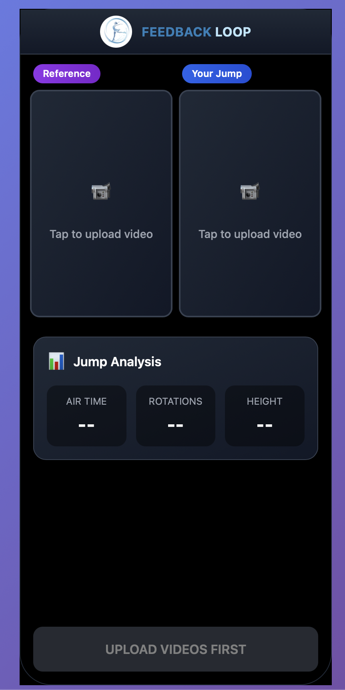

# ⛸️ Feedback Loop - Figure Skating Jump Analyzer

<div align="center">

### 🌟 [**Try the Live App →**](https://figure-skating.github.io/feedback-loop/)

[](https://figure-skating.github.io/feedback-loop/)


</div>

A modern web application that uses AI-powered pose detection to analyze figure skating jumps, providing biomechanical insights and performance feedback for skaters and coaches.

## ✨ Features

### 🎯 Core Analysis
- **AI-Powered Pose Detection**: Real-time skeletal tracking using Google's MediaPipe
- **Jump Comparison**: Side-by-side analysis of reference vs. user jumps  
- **Biomechanical Metrics**: Air time, rotation speed, jump height, landing stability
- **Frame-Accurate Marking**: Precise takeoff and landing identification

### 📱 Modern Experience  
- **Mobile-First Design**: Optimized for iPhone and tablet use
- **Drag & Drop Upload**: Easy video import with multiple format support
- **Progressive Web App**: Works offline, installable on mobile devices
- **Real-Time Processing**: Instant feedback with smooth 30fps playback

### 📊 Visualization & Export
- **Multiple View Modes**: Switch between video and skeleton overlay
- **Interactive Timeline**: Scrub through analysis with synchronized playback
- **Angle Analysis**: Detailed knee flexion and body position tracking
- **Video Export**: Share analyzed jumps with overlay graphics

## 🚀 Quick Start

### Prerequisites
- Node.js 18+ and npm
- Modern browser with WebGL support
- Camera or video files of figure skating jumps

### Installation

```bash
# Clone the repository
git clone https://github.com/figure-skating/feedback-loop.git
cd feedback-loop

# Install dependencies
npm install

# Start development server
npm run dev
```

The app will be available at `http://localhost:5173` for local development.

**Live Demo**: https://figure-skating.github.io/feedback-loop/

### For Mobile Testing
```bash
# Start with network access for mobile testing
npm run dev

# Access from your phone at:
# http://[your-computer-ip]:5173
```

## 📖 How to Use

1. **Upload Reference Video**: Add a video of a well-executed jump (coach demonstration, professional skater, etc.)

2. **Upload Your Jump**: Add your own jump attempt for comparison

3. **Mark Key Frames**: Use the guided wizard to identify takeoff and landing moments in both videos

4. **Analyze**: Let the AI process both videos to extract pose data and calculate metrics

5. **Compare & Learn**: Review the side-by-side analysis, metrics, and angle charts to understand differences

6. **Export & Share**: Save your analyzed jump video with overlaid graphics

## 🏗️ Technology Stack

### Frontend Framework
- **React 18** with hooks and modern patterns
- **TypeScript** for type safety and developer experience  
- **Vite** for fast development and optimized builds
- **Tailwind CSS** with custom ice-blue theme

### AI & Computer Vision
- **MediaPipe Pose** for real-time human pose estimation
- **Canvas API** for skeleton overlay rendering
- **Web Workers** for background video processing
- **WebGL** for GPU-accelerated operations

### Data & Storage
- **Zustand** for reactive state management
- **IndexedDB** for client-side video storage
- **LocalStorage** for user preferences and session data

### Video Processing
- **HTML5 Video API** for playback control
- **Canvas API** for frame extraction and export
- **Web Codecs API** for video encoding (where supported)

## 🎯 Target Sports & Applications

### Primary Focus
- **Figure Skating**: All jump types (Axel, Lutz, Flip, Loop, Salchow, Toe Loop)
- **Coaching Tools**: Technique comparison and improvement tracking
- **Self-Analysis**: Individual skater development

### Future Potential
- Dance and artistic movement analysis  
- Other sports with jumping mechanics
- Physical therapy and rehabilitation
- General movement quality assessment

## 🛠️ Development

### Available Scripts
```bash
npm run dev          # Start development server
npm run build        # Build for production  
npm run preview      # Preview production build
npm run type-check   # Run TypeScript checks
npm run lint         # Lint code (when configured)
```

### Project Structure
```
src/
├── components/          # React components
│   ├── Analysis/       # Charts, metrics, timeline
│   ├── Layout/         # App structure, containers  
│   └── Video/          # Video players, upload
├── hooks/              # Custom React hooks
├── services/           # MediaPipe, analysis logic
├── store/              # Zustand state management
├── styles/             # Tailwind CSS configuration  
└── utils/              # Helper functions, constants
```

### Key Components
- **VideoContainer**: Handles upload, storage, and playback
- **FrameMarkingWizard**: Guided takeoff/landing identification
- **VideoPlayer**: Synchronized playback with pose overlay
- **TimelineWithMarkers**: Scrub control with jump phases
- **AngleChart**: Real-time biomechanical analysis

## 🤝 Contributing

We welcome contributions! This project is perfect for:

- **Sports Enthusiasts**: Add new sports or improve analysis algorithms
- **Web Developers**: Enhance UI/UX or add new features  
- **AI/ML Engineers**: Improve pose detection or add new metrics
- **Mobile Developers**: Optimize mobile experience or add native features

### Getting Started
1. Fork the repository
2. Create a feature branch (`git checkout -b feature/amazing-feature`)
3. Make your changes with tests
4. Commit your changes (`git commit -m 'Add amazing feature'`)
5. Push to your branch (`git push origin feature/amazing-feature`)
6. Open a Pull Request

See [CONTRIBUTING.md](CONTRIBUTING.md) for detailed guidelines.

## 📄 License

This project is licensed under the MIT License - see the [LICENSE](LICENSE) file for details.

## 🙏 Acknowledgments

- **MediaPipe Team** for the incredible pose detection models
- **Figure Skating Community** for inspiration and feedback
- **Open Source Contributors** who make projects like this possible

## 🔗 Links

- [Live Demo](https://figure-skating.github.io/feedback-loop/) *(GitHub Pages)*
- [Documentation](https://github.com/figure-skating/feedback-loop/wiki) *(coming soon)*
- [Issue Tracker](https://github.com/figure-skating/feedback-loop/issues)
- [Discussions](https://github.com/figure-skating/feedback-loop/discussions)

---

**Built with ❤️ for the figure skating community**

*Feedback Loop helps skaters and coaches unlock the power of AI for technique analysis and improvement.*